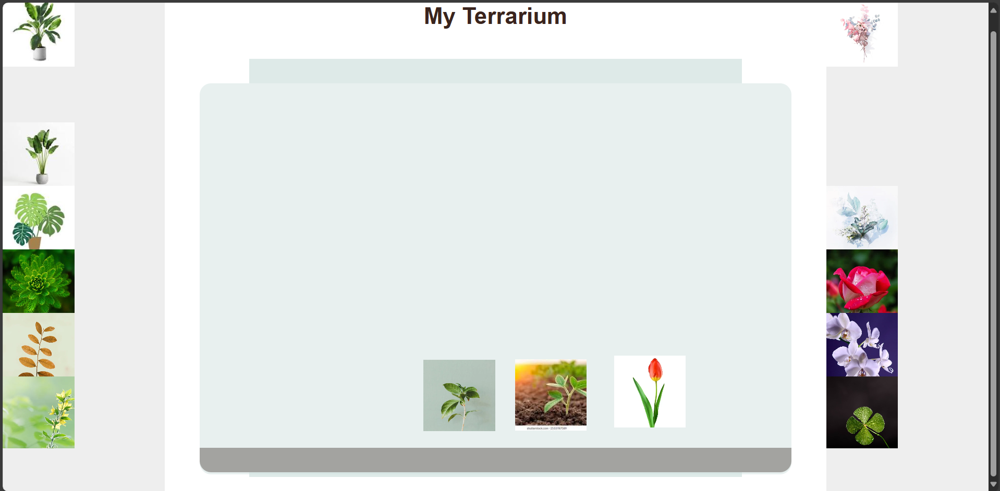

# Draggable Terrarium

A fun and interactive web project where users can drag and drop plants into a terrarium. Perfect for learning basic HTML, CSS, and JavaScript concepts!

## Features
- Drag-and-drop functionality for plants.
- Responsive layout for both desktop and mobile screens.
- Simple CSS-based terrarium visualization.

## Technologies Used
- HTML
- CSS
- JavaScript

## How to Use
1. Clone or download the repository.
2. Open the `index.html` file in a web browser.
3. Drag plants from the left or right containers into the terrarium.

## Screenshot
![Screenshot of Draggable Terrarium]

## How to Contribute
Feel free to submit issues or pull requests to improve this project.

## License
This project is licensed under the MIT License.
